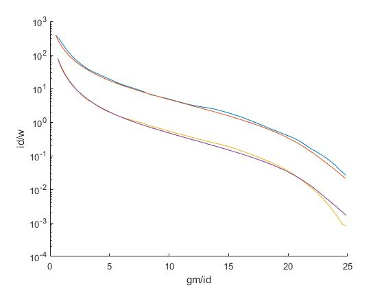

# Transistor Neural Network Modeler
This project implements a versatile modeling system that can be used to create neural network models
for simulated data, allowing versatile mappings to be made. For example, when simulating transistor characteristics
normally a simulation program takes in the given width and length of the transistor, then calculates its DC operating point, and the
resulting transistor characteristics such as transconductance and drain current are calculated.
This modeling tool can be used to take in simulated data from an existing transistor, and output custom mappings. For example, a model could be trained
which takes as inputs the gm/id and fug which the designer requires, and then it will output the length of the cooresponding transistor
along with the resulting id/w. This allows a circuit designer the freedom to choose more important metrics of their
transistor such as power efficiency, and be given the needed width and length as opposed to having to guess
the correct width and length for the desired efficiency. 

Example code is given for parsing data from multiple formats and using the data to train a model. Examples of using the model
and graphing resulting curves to visualize how well  the model fit the input dataset are given both in Java and 
in Matlab. Many alterations can be made to the training parameters, and even the structure of the neural network itself in order
to better fit a particular set of data.

## Installation

Clone this repository:

```bash
$ git clone https://github.com/Aprucka19/Transistor-Neural-Network-Modeler.git
```

`cd Transistor-Neural-Network-Modeler` into the directory and install the maven package:

```bash
$ mvn install
```

The jar and dependencies for the repository will be installed within the directory where the repository was cloned

The jar can be found in the target folder created when the mvn install command is called, and the path will be relevant when utilizing the 
matlab interface for a trained model

Opening the downloaded repository will reveal examples on running the model within the test folder, and in the main folder all the relevant
classes are stored

To use the classes in your own project add the following maven dependency to your pom.xml

```xml
<dependency>
    <groupId>edlab.eda.transistorModel</groupId>
    <artifactId>Transistor-Neural-Network-Modeler</artifactId>
    <version>1.0.0-beta7</version>
</dependency>
```

Then import the corresponding package to your code
```java
import edlab.eda.transistorModel.*;
```

### MATLAB

There are two variants how the JAR can be loaded in MATLAB.
The first possibility is to run the command

```matlab
javaaddpath('<PATH_TO_JAR>');
```

The second possibility is to add the path to the JAR to
the file *javaclasspath.txt* and place this file in the working directory
of MATLAB (this is the directory where MATLAB is started).

Additionally, the corresponding scripts must be added to the search-path of
MATLAB

```matlab
addpath('<PATH_TO_REPOSITORY>/src/main/matlab/');
addpath('<PATH_TO_REPOSITORY>/src/test/matlab/');
```

Additional information can be found in the MATLAB and Octave Manuals

- MATLAB
    * [Java Class Path](https://de.mathworks.com/help/matlab/matlab_external/java-class-path.html)
    * [Search Path](https://de.mathworks.com/help/matlab/search-path.html)
- Octave
    * [How to make Java classes available to Octave?](https://octave.org/doc/v4.0.1/How-to-make-Java-classes-available_003f.html)
    * [Manipulating the Load Path](https://octave.org/doc/v4.0.1/Manipulating-the-Load-Path.html) 


## Example 1:
The TrainModel example code within the test folder parses a dataset in the form of a csv file, and trains
a network to the model. It then evaluates the fit of the network on the data and prints relevant metrics representing how well 
the data was fit by the model. The model is then saved along with a metadata file which would represent data relevant 
to the transistor being simulated

The UseModel example code within the test file uses the model created in TrainModel, and shows how the model can be used
to calculate outputs given inputs for small or larger datasets. It also plots curves for the fit of the network at certain length versus the data that was provided
with the simulation. The Model used in the example takes as inputs the gm/id desired, and the fug desired of the transistor, and 
gives the corresponding id/w and L values. Pictured below are the resulting curves from the trained model.


With the example parameters the fit of the data
is not perfect such as to emphasize the difference between the simulated and modeled outputs, however with tweaks to the training parameters
and the layout of the network itself extremely accurate fits can be achieved as shown below.


## Example 2:
The SimulationToChart example parses data from a .raw file given directly from a transistor simulation. It then transforms the output columns of the data to the 
desired four columns (gm/id, fug, L, id/w) and trains a network based upon the transformed data. The trained network is then saved and loaded again to
be used to analyze the achieved fit on the input data.

Two lengths are sampled and the gm/id vs id/w curves are plotted correspondingly. Once again the model is not perfectly fit in the example to emphasize the difference between the 
simulated and modeled data, but like in Example 1 with parameter changes the model can be fit to be nearly perfect.


## Using a Trained Model in Matlab

The example Matlab code given in the test/Matlab folder uses the path to a trained model (The model trained by the example code SimulationToChart), and takes in simulation data via a 
csv file (also generated within the SimulationToChart example from the input .raw file)
Loading a trained model into Matlab is by far the fastest and most intuitive way to visualize the modeled data 

It then uses the class given in the main/Matlab folder to interface with the java code and accept matlab matricies as inputs to the model.
In a similar fashion to the java example, multiple lengths are then chosen and the model fit versus the simulated fit
are graphed. Using matlab and allowing the interface between matlab matricies and the trained model alows for much easier data manupulation, 
and far easier visualization of the model itself with matlabs intuitive plotting tools.



Using the model matlab is also able to intuitively plot the output characteristics of the model in higher dimensions. 
This plot shows the corresponding id/w for and gm/id and fug given. The resulting curve covers far more points than the input simulation did.


