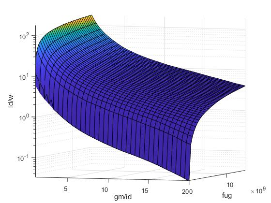

# Transistor Neural Network Modeler
This project implements a versatile modeling system that can be used to create neural network models
for simulated data, allowing various mappings to be made. For example, when simulating transistor characteristics
normally a simulation program takes in the given width and length of the transistor, then calculates its DC operating point, and the
resulting transistor characteristics such as transconductance and drain current are calculated.
This modeling tool can be used to take in simulated data from an existing transistor, and output custom mappings. For example, a model could be trained
which takes as inputs the gm/id and fug which the designer requires, and then it will output the length of the cooresponding transistor
along with the resulting id/w. This allows a circuit designer the freedom to choose more important metrics of their
transistor such as power efficiency, and be given the needed width and length as opposed to having to guess
the correct width and length for the desired efficiency. 

Example code is given for parsing data from multiple formats and using the data to train a model. Examples of using the model
and graphing resulting curves to visualize how well  the model fit the input dataset are given both in Java and 
in Matlab. Many alterations can be made to the training parameters, and even the structure of the neural network itself in order
to better fit a particular set of data.

## Installation

This project makes use of java 1.8 and maven. If these are not set up on your system
follow the first three instructions [here](https://www.tutorialkart.com/machine-learning/setup-environment-for-deep-learning-with-deeplearning4j/).
IntelliJ is not required but may make using the library easier.

This repository makes use of an aditional repository called nutmeg-reader in order to parse .raw simulation files directly
from spectre

Clone this repository:

```bash
$ git clone https://github.com/electronics-and-drives/nutmeg-reader.git
```

`cd nutmeg-reader` into the directory and install the maven package:

```bash
$ mvn install
```

Now that the dependency is available to maven, clone this repository:


```bash
$ git clone https://github.com/Aprucka19/Transistor-Neural-Network-Modeler.git
```

`cd Transistor-Neural-Network-Modeler` into the directory and install the maven package:

```bash
$ mvn install
```

The jar and dependencies for the repository will be installed within the target folder of the  directory where the repository was cloned

Opening the downloaded repository will reveal examples on running the model within the test folder, and in the main folder all the relevant
classes are stored

To use the classes in your own project add the following maven dependency to your pom.xml

```xml
<dependency>
    <groupId>edlab.eda.transistorModel</groupId>
    <artifactId>Transistor-Neural-Network-Modeler</artifactId>
    <version>1.0.0-beta7</version>
</dependency>
```

Then import the corresponding package to your code
```java
import edlab.eda.transistorModel.*;
```

So that your own project builds the jar with dependencies correctly when running the mvn install command, add this to your pom.xml file

```xml
<plugin>
    <groupId>org.apache.maven.plugins</groupId>
    <artifactId>maven-assembly-plugin</artifactId>
    <version>2.4.1</version>
    <configuration>
        <descriptorRefs>
            <descriptorRef>jar-with-dependencies</descriptorRef>
        </descriptorRefs>
    </configuration>
    <executions>
        <execution>
            <id>make-assembly</id>
            <phase>package</phase>
            <goals>
                <goal>single</goal>
            </goals>
        </execution>
    </executions>
</plugin>
```


## Example 1:
The TrainModel example code within the test folder parses a dataset in the form of a csv file, and trains
a network to the model. It then evaluates the fit of the network on the data and prints relevant metrics representing how well 
the data was fit by the model. The model is then saved along with a metadata file which would represent data relevant 
to the transistor being simulated

The UseModel example code within the test file uses the model created in TrainModel, and shows how the model can be used
to calculate outputs given inputs for small or larger datasets. It also plots curves for the fit of the network at certain length versus the data that was provided
with the simulation. The Model used in the example takes as inputs the gm/id desired, and the fug desired of the transistor, and 
gives the corresponding id/w and L values. Pictured below are the resulting curves from the trained model.


With the example parameters the fit of the data
is not perfect such as to emphasize the difference between the simulated and modeled outputs, however with tweaks to the training parameters
and the layout of the network itself extremely accurate fits can be achieved as shown below.


## Example 2:
The SimulationToChart example parses data from a .raw file given directly from a transistor simulation from spectre. It then transforms the output columns of the data to the 
desired four columns (gm/id, fug, L, id/w) and trains a network based upon the transformed data. The trained network is then saved and loaded again to
be used to analyze the achieved fit on the input data.

Two lengths are sampled from the input dataset housing ~100 lengths 
and the gm/id vs id/w curves are plotted correspondingly. With tuned parameters the curves can be nearly identical
as shown below


## Tips for Training a Model

The easiest and often most impactful parameters to change are taken as inputs to the TransistorNNModel object when it is 
first created.


- Batch Size: Analyze the curves in the UI when training on your dataset, and pick a batch size that lowers score per iteration in the beginning dramatically

- Number of Epochs: More is generally better however more will take longer to train

- Learning Rate: If your score curve during training is flat and never shifts, your learning rate is too high or low

- Transform Cols: If some of your data is not well distributed over its range, transforming it will significantly increase the fit of your model

You can also replace the stock model configuration itself by using the setConfig function 
for your TransistorNNModel object. This allows you to customize your model in other ways such as adjusting the 
setDefaultConfig class, adding or removing layers, changing activation functions, etc. This project is built using DL4J, 
whose [documentation](https://deeplearning4j.konduit.ai/getting-started/core-concepts)
also holds lots of potentially useful information when training a model.

When training on large data sets with a large model layout, using the CUDA backend in order to speed up computation when training
the model can be very useful. Follow the instructions at the link below to achieve this.

- [Backend for Training](https://deeplearning4j.konduit.ai/config/backends)

### MATLAB

There are two variants how the JAR can be loaded in MATLAB.
The first possibility is to run the command

```matlab
javaaddpath('<PATH_TO_JAR>');
```

The second possibility is to add the path to the JAR to
the file *javaclasspath.txt* and place this file in the working directory
of MATLAB (this is the directory where MATLAB is started).

Additionally, the corresponding paths must be added to the search-path of
MATLAB

```matlab
addpath('<PATH_TO_REPOSITORY>/src/main/matlab/');
addpath('<PATH_TO_REPOSITORY>/src/test/matlab/');
```

Additional information can be found in the MATLAB and Octave Manuals

- MATLAB
  * [Java Class Path](https://de.mathworks.com/help/matlab/matlab_external/java-class-path.html)
  * [Search Path](https://de.mathworks.com/help/matlab/search-path.html)
- Octave
  * [How to make Java classes available to Octave?](https://octave.org/doc/v4.0.1/How-to-make-Java-classes-available_003f.html)
  * [Manipulating the Load Path](https://octave.org/doc/v4.0.1/Manipulating-the-Load-Path.html)


The example Matlab code given in the test/Matlab folder uses the path to a trained model (The model trained by the example code SimulationToChart), and takes in simulation data via a 
csv file (also generated within the SimulationToChart example from the input .raw file)
Loading a trained model into Matlab is by far the fastest and most intuitive way to visualize the modeled data 

It then uses the class given in the main/Matlab folder to interface with the java code and accept matlab matricies as inputs to the model.
In a similar fashion to the java example, multiple lengths are then chosen and the model fit versus the simulated fit
are graphed. Using matlab and allowing the interface between matlab matricies and the trained model alows for much easier data manupulation, 
and far easier visualization of the model itself with matlabs intuitive plotting tools.

In the next section, a static version of the liveScript can be seen to explain the matlab workflow. This script is stored in the test/Matlab folder.
Within matlab the liveScript is interactable with sliders and boxes to change which values are plotted. 

The TestOptimizer file contains code and implements functions which automatically optimize two different 
circuit designs, a Symmetrical Amplifier and a Swing Current Mirror. Further information is displayed after the static live script
section.

NOTE: if you recomplied the jar file for the project using mvn install after utilizing the CUDA backend, matlab will not function with the Java Objects.
You must swap the dependencies back to the CPU backend then execute the mvn install again.

# Using a Trained Model In Matlab


First you must specify the path to your Transistor-Neural-Network-Modeler repository


```matlab:Code
pathToRepository = "C:/Users/Alex Prucka/IdeaProjects/Transistor-Neural-Network-Modeler/";
```


The path to the Matlab NNModel class is added to the classpath, and the path to the pmos1 model file is specified


```matlab:Code
modelPath = pathToRepository + "src/test/resources/pmos1.bin";
classPath = pathToRepository + "src\main\Matlab";
addpath(classPath)
```


A NNModel object is created, and the properties of the model are then printed, which contain the input and output column labels


```matlab:Code
model = NNModel(modelPath);
model.properties
```


```text:Output
ans =

  java.lang.String[]:

    'Input Columns: '
    'M0:gmoverid'
    'M0:fug'
    'Output Columns: '
    'L'
    'id/w'
```


Then the input and output data used to train the model is read from a csv file to the csvData variable


```matlab:Code
csvFile = pathToRepository + "src\test\resources\simDataPmos.csv";
csvData = dlmread(csvFile, ",", 0, 0);
```


Here you can select two indexs, where each index value samples a different transistor length to run through the created model


```matlab:Code
index1 = 13000;
index2 = 6000;
data1 = csvData(csvData(:,3)==csvData(index1,3),:);
data2 = csvData(csvData(:,3)==csvData(index2,3),:);
```


The output from the NNModel for both sizes is then saved


```matlab:Code
results = model.useModel(data1(:,1:2));
results2 = model.useModel(data2(:,1:2));
```


The data is then plotted for id/w vs gm/id from both the simulated data and the model output


```matlab:Code
figure
hold on
plot(data1(:,1),results(:,2))
plot(data1(:,1),data1(:,4))
plot(data2(:,1),results2(:,2))
plot(data2(:,1),data2(:,4))
title("id/w vs gm/id for L = "+csvData(index1,3)+"m and "+csvData(index2,3)+"m")
set(gca, 'YScale', 'log')
xlabel("gm/id (1/V)")
ylabel("id/w (A/m)")
legend("Model "+csvData(index1,3)+"m","Simulation "+csvData(index1,3)+"m", "Model "+csvData(index2,3)+"m", "Simulation "+csvData(index2,3)+"m")
hold off
```


Now length vs gm/id are compared between the two


```matlab:Code
figure
hold on
plot(data1(:,1),results(:,1))
plot(data1(:,1),data1(:,3))
plot(data2(:,1),results2(:,1))
plot(data2(:,1),data2(:,3))
title("L vs gm/id for L = "+csvData(index1,3)+"m"+" and "+csvData(index2,3)+"m")
set(gca, 'YScale', 'log')
xlabel("gm/id (1/V)")
ylabel("L (m)")
legend("Model "+csvData(index1,3)+"m","Simulation "+csvData(index1,3)+"m", "Model "+csvData(index2,3)+"m", "Simulation "+csvData(index2,3)+"m")
hold off
```


Some of the charts and examples which take longer to run do not integrate as well into the live script (Such as characterizing the model over an enormous range of values), and thus they are housed in the JavaInMatlab.m file where you can run them


# Plotting Curves for Desired Frequencies


These charts are an example of how the models may be used in design work. The apropriate fug would be placed in the system, then the plots would show necesary length and id/w for whatever gm/id is desired for the transistor


Here a Fug is chosen with a slider, and the corresponding id/w and L values are calculated by a model for all gm/id in a range


```matlab:Code
fug = 10000000;
calc =  [1:.01:20]';
calc(:,2) = fug;
calcResults = model.useModel(calc);
```


Here the id/w vs gm/id is plotted


```matlab:Code
figure
hold on
plot(calc(:,1),calcResults(:,2))

title("id/w vs gm/id for fug = "+fug+"Hz")
set(gca, 'YScale', 'log')
xlabel("gm/id (1/V)")
ylabel("id/w (A/m)")
hold off
```


Here the L vs gm/id is plotted


```matlab:Code
figure
hold on
plot(calc(:,1),calcResults(:,1))
title("L vs gm/id for fug = "+fug+"Hz")
xlabel("gm/id (1/V)")
ylabel("L (m)")
hold off
```


## 3D Surf Figure
Using the model matlab is also able to intuitively plot the output characteristics of the model in higher dimensions. 
This plot shows the corresponding id/w for any gm/id and fug given. The resulting curve covers far more points than the input simulation did.
Due to the number of points that need to be calculated, creating this figure can take a few minutes. As such the code to 
create it is stored in the JavaInMatlab.m script where it can be ran. 



##Automatic Circuit Optimizers

The TestOptimizer file contains code and implements functions which automatically optimize two different
circuit designs, a Symmetrical Amplifier and a Swing Current Mirror for whatever desired gain and output resistance is given.
The resulting transistor widths and lengths needed are then displayed, and then the performance of the resulting transistor can
then be verified in a circuit simulator.

The script uses matlabs fminsearch funciton to find the exact fugs needed for each relevant transistor in order to acheive the desired
gain or output resistance. These minimizing functions are contained in the files symAmp.m, VxFinder.m, and swingMirror.m.

Within the TestOptimizer.m file, thorough descriptions of exactly how the model files are used and exactly what information is needed
as input in order to return the desired widths and lengths is given. Note however that the models used to 
create the optimizer were trained on a transistor technology which is under NDA, and as such the model files themselves could
not be included in the github. In order to run the code to automatically find the widths and lengths, you will need to train
models with the same mappings yourself (detailed in the script).

